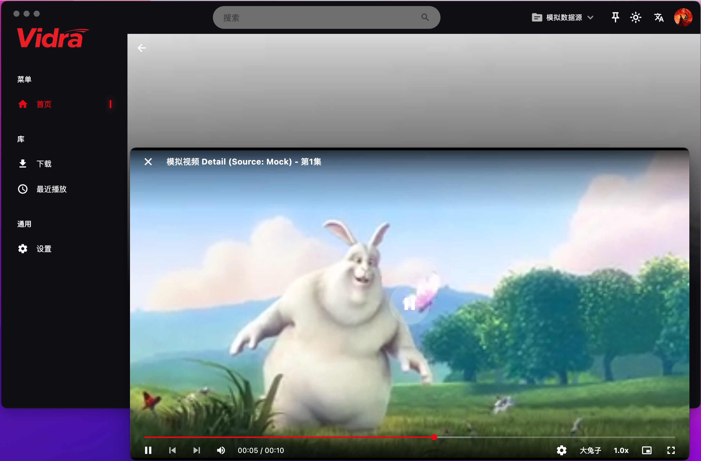

# Vidra

## 项目简介

Vidra 是一个在**闲暇时间**以 **AI 辅助开发为主**完成的 **Flutter 桌面端视频播放框架与技术实验项目**。

项目核心目标并非提供具体内容服务，而是围绕以下技术方向进行探索与实践：

- 跨平台桌面端视频播放能力（可切换的双播放引擎）
- 可插拔的数据源抽象设计（多源并存、跨源关联）
- 原生 Rust 媒体解析与下载引擎的 FFI 集成
- 智能化的观看辅助（片头片尾检测、追剧订阅、更新节奏学习）
- 多语言、多主题、多窗口的应用架构
- AI 辅助开发在真实项目中的应用方式

Vidra 更偏向于一个**播放器能力验证与架构示例**，适用于学习、研究与个人技术实践场景。

---

## 设计理念

- 🧱 **框架化设计**：以播放器能力与架构为核心，而非内容本身
- 🔌 **可插拔数据源**：通过抽象接口接入不同数据来源，实现解耦
- 🌍 **跨平台一致性**：统一代码结构，支持 macOS / Windows
- 🎨 **多形态 UI 能力**：多语言、多主题、多窗口并存
- 🤖 **AI 辅助工程实践**：探索 AI 在真实开发流程中的边界与效率
- 🧪 **学习与研究导向**：不以产品化或商业化为目标

---

## 功能概览

| 领域 | 能力 |
|---|---|
| 播放 | 多集/多画质、断点续播、PiP、独立播放窗口、键盘快捷键 |
| 缩略图 | 进度条悬停预览（后台 16x 扫描生成 sprite，全平台） |
| 片头片尾 | 手动标记、跨集感知哈希自动检测、自动跳过；检测结果与哈希持久化 |
| 追剧订阅 | 三层零打扰更新检测、更新节奏学习（中位数间隔）、顶栏铃铛 + 系统通知 |
| 跨源 | 同剧跨源识别（标题+年份精确匹配）、观看进度标注、他源抢先更新提醒、详情页切换他源剧集列表 |
| 下载 | 基于 vidraDlp（Rust/FFI）的链接解析与下载：YouTube、Bilibili 等；HLS/DASH、断点续传 |
| 应用 | 多窗口、i18n（中/英）、深浅主题、Drift 数据库（幂等迁移） |

---

## 数据源说明

Vidra 本身**不内置、也不提供任何固定的视频内容服务**。

- 项目通过 **Data Source 抽象层** 进行数据接入
- 当前仓库中仅包含**示例级数据源实现**（olevod、dbku 两个示例），用于验证多源架构（跨源匹配、源切换）的可行性
- 所有示例数据**均归原始平台或内容提供方所有**
- 示例实现仅用于技术研究，不构成任何内容分发行为

开发者可基于该抽象层自行实现符合当地法律法规的数据源。

---

## 使用声明（非常重要）

⚠️ **请在使用或二次开发前仔细阅读以下声明**：

- Vidra 是一个**技术研究与播放器框架示例项目**
- 项目代码本身**不提供、不托管、不分发任何视频内容**
- 仓库中出现的任何数据源实现仅用于**架构与技术验证示例**
- 本项目不包含任何形式的商业行为，包括广告、收费或内容变现
- 使用者在本地运行或自行扩展数据源时，应**自行确保符合当地法律法规**
- 作者不对使用者的具体使用方式及其可能产生的法律后果承担责任

如不同意以上声明，请勿使用或传播本项目代码。

---

## 核心架构

### 1. 播放引擎：vidra_player SDK（双引擎可切换）

播放能力由独立的 [VidraPlayer SDK](https://github.com/heyvidra/VidraPlayer) 提供，
Vidra 只是它的一个宿主。SDK 通过适配器模式支持两个可互换的引擎：

- **fvp / mdk**：基于 FFmpeg 的高性能引擎（当前默认）
- **media_kit / mpv**：同一接口的另一实现

切换引擎只需更换一个依赖包，播放、缩略图扫描、片头检测等能力在两个引擎上保持一致。
宿主侧通过 `MediaRepository` / `EpisodeMarkerStore` / `EpisodeHashStore`
三个接口向 SDK 提供持久化，其中后两个是可选的 —— 这也是 SDK
"新增能力不破坏既有宿主"的接口演进方式。

### 2. 下载引擎：vidraDlp（Rust / C ABI / FFI）

链接解析与下载由独立的 Rust 库 **vidraDlp** 承担，经 C ABI 通过
`dart:ffi` 接入：

- 媒体元数据解析（格式列表、清晰度、时长）
- HTTP / HLS（AES-128、BYTERANGE）/ DASH 下载，断点续传
- 提取逻辑与 yt-dlp 行为同步（Rust 重写，非子进程调用）

原生库不入库：CI 构建时从 vidraDlp 的 Release 拉取最新版本，
本地开发将 `libmedia_ffi.dylib`（macOS）/ `media_ffi.dll`（Windows）
放到对应平台目录即可，缺失时下载功能自动隐藏、播放不受影响。

### 3. 窗口系统：bitsdojo_window 之上的多窗口框架

基于 **bitsdojo_window**（及其扩展 **bitsdojo_window_plus**）构建：

- 无边框窗口、自定义标题栏
- 主窗口 / 播放窗口 / 辅助窗口职责拆分，窗口状态与业务状态解耦
- 窗口级主题联动

独立播放窗口支持沉浸式观看：



### 4. 数据层：Drift + 幂等迁移

SQLite（Drift）承载历史、设置、订阅、跳过标记与感知哈希。
迁移的每一步都是**幂等**的（加列前查列、建表前查表），整体包在一个事务里 ——
这是从一次真实的"半迁移数据库崩溃循环"中学到的：版本号算术无法描述半执行的升级，
只有向数据库本身提问才可靠。

### 5. 追剧订阅：零打扰的更新检测

订阅功能的核心约束是**检查成本不随订阅数增长**，三层由廉到贵：

1. **浏览即检查**（零请求）：目录页本就携带每部剧的更新进度，滚过即比对
2. **每源一页**（≤源数个请求）：用"最近更新"列表与订阅集求交
3. **到期确认**（每轮 ≤5 个请求）：仅当学习到的更新节奏（中位数间隔）
   判断"今天该更了"才发起单剧查询；完结剧永久停查

同一部剧在另一源抢先更新时（标题+年份匹配），订阅同样会收到提醒，
且他源的进度文本与本源严格隔离，不污染节奏学习。

---

## 本地运行与开发

### 环境要求

- Flutter SDK（stable 最新版本）
- macOS：Xcode ／ Windows：Visual Studio（Desktop development with C++）

### 运行

```bash
flutter config --enable-macos-desktop   # 或 --enable-windows-desktop
flutter pub get
flutter run -d macos                     # 或 -d windows
```

（可选）下载功能需要 vidraDlp 原生库：从其 Release 下载后放入
`macos/libmedia_ffi.dylib` 或 `windows/media_ffi.dll`。

### 测试

```bash
flutter test        # 含迁移、订阅节奏、跨源匹配的回归测试
flutter analyze
```

### 发布

推送 `v*` tag 触发 GitHub Actions，自动构建 macOS（DMG）与 Windows（MSI）
产物，并在构建时拉取最新 vidraDlp 原生库（所用版本写入构建摘要）。

macOS 安装后需手动放行（无开发者证书，adhoc 签名）：

```bash
xattr -dr com.apple.quarantine /Applications/Vidra.app
```

> 注：release 版未启用 App Sandbox —— adhoc 签名下开启沙盒无法启动，
> 这是在获得开发者证书之前的刻意取舍。

---

## AI 在项目中的角色

Vidra 并不是"AI 自动生成的项目"，但 AI 在其中承担了重要的辅助角色：

- 架构方案讨论与取舍记录
- 功能实现与回归测试（含红/绿验证流程）
- 真实故障的根因定位（dyld 双库冲突、数据库半迁移、采样抖动等）

AI 被视为一个**工程协作者**，而不是替代开发者的工具。项目中的关键决策
均以"先测量、后修改"的方式进行，测量结果记录在代码注释与提交信息中。

---

## 这个项目适合谁？

- 希望学习 **Flutter Desktop 架构设计** 的开发者
- 对 **多媒体播放 / 媒体解析** 有兴趣的工程师
- 想探索 **AI 辅助开发实际效果** 的技术人员

如果你的目标是内容分发或商业产品，这个项目并不适合你。

---

## License

本项目基于 **MIT License** 开源，仅代码本身遵循该协议，**不包含任何第三方内容授权**。
